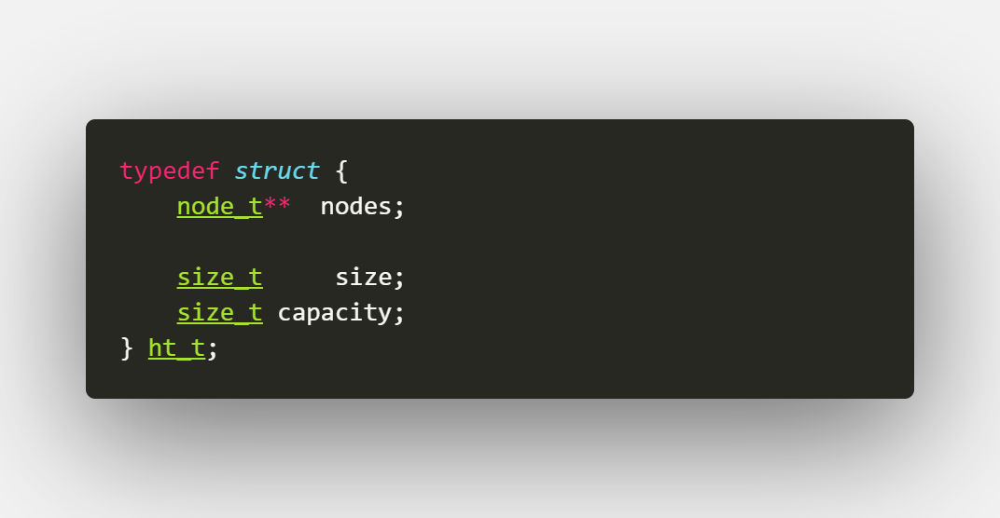
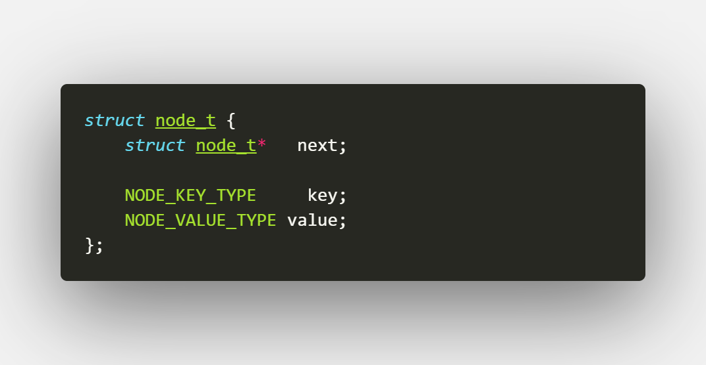
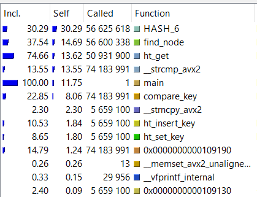
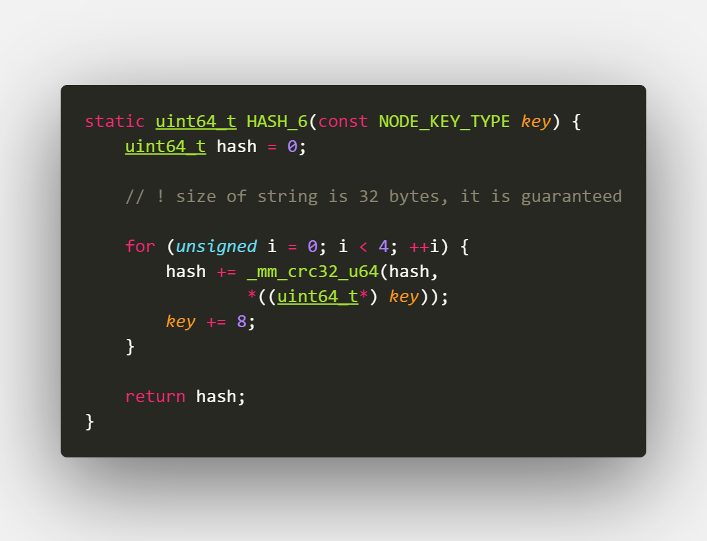
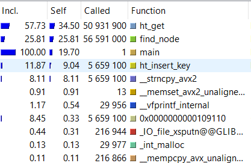
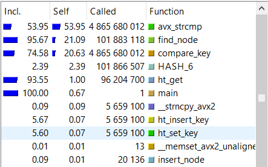
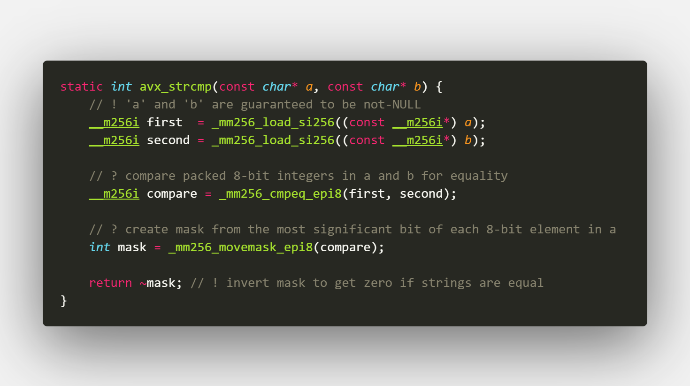
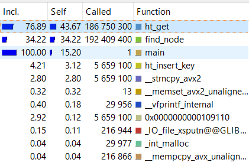
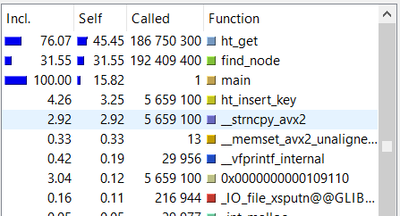

# Fast hash table (using AVX2/ASM/SSE)

# О проекте

Перед прочтением данной статьи читателю настоятельно рекомендуется изучить:
### 1) [Структуру (Хеш-таблица)](https://en.wikipedia.org/wiki/Hash_table)
### 2) [SIMD-инструкции](https://ru.wikipedia.org/wiki/SIMD)
### 3) [CRC32-хеш](https://en.wikipedia.org/wiki/Cyclic_redundancy_check)

Целью данного проекта стояла реализация хеш-таблицы закрытого (!) типа и ее оптимизация с помощью Intrinsic-functions (SIMD-инструкции), ассемблерных вставок, а также ассемблерных функций. Важно заметить, что хеш-таблица должна быть универсальной - уметь работать с любыми типами ключей и значений. 

# Этапы выполнения работы и оптимизаций

##  Первая часть: написание хеш-таблицы

### Кратко о хеш-таблице:

За FILL-factor (size of hash table / capacity of hash table) было взято значение 0.72f (такое же, как в хеш-таблице в языке C#).
Опыт показал, что значения 0.7-0.75 оптимальны. Так, в языке Java используется значение 0.75f.

За GROWTH-factor было взято значение ~1.61 (1 + (sqrt(5) - 1) / 2), что, доказано математически, оптимально при обьеме данных, стремящемся к бесконечности.

Структуры хеш-таблицы и ее элемента (node_t, таблица построена на односвязных списках) задаются так:

### Важно отметить, что типы NODE_VALUE_TYPE и NODE_KEY_TYPE задаются пользователем в специальном файле - [types_config.h](src/asm_optimise/types_config.h), что делает настройку хеш-таблицы очень удобной и простой.
Более того, все функции хеширования/сравнения ключей, а также возвращаемые default-параметры ключа и значения также кастомизируются  пользователем в файле [types_config](src/asm_optimise/types_config.h).

## Профилирование программы, первая оптимизация

После написания хеш-таблицы я начал замерять абсолютное и относительное время работы каждой функции с помощью инструмента [valgrind](https://valgrind.org/) под названием [callgrind](https://valgrind.org/docs/manual/cl-manual.html) 

Тут приведены результаты работы callgrind над программой, запущенной БЕЗ оптимизаций.

Очевидно, что самым важным для оптимизации и "узким" местом программы является функция HASH-6, то есть CRC32, являющаяся default-функцией для нахождения хешей в моей хеш-таблице. 

Я решил переписать свою хеш-функцию с использованием Intrinsic-функций (то есть, simd-инструкций). Изменив принцип хранения слов в своем тексте, выравнивая буффер для каждого слова по 32 (на самом деле - кладя все слова в один буффер по адресам, кратным 32), я узнал максимальную длину каждого слова (32 - абсолютный максимум, в выбранном мною тексте - "Война и мир", нет ни одного слова, длиннее 22 букв).
Это позволило мне использовать Intrinsic _mm_crc32_u64. Таким образом, время подсчета одного слова ограничивалось 4 итерациями цикла с нахождением crc32 (32 / 4). 

Результат оптимизации превзошел все мои ожидания! Время работы хеш-функции уменьшилось в десятки раз!

:

## Вторая оптимизация

Посмотрим на время работы функции, сравнивающей строки:

После первой оптимизации стало очевидно, что, кроме функций find_node && ht_get узким местом моей программы являлась функция strcmp.
Изначально я использовал функцию strcmp из стандартной библиотеки языка C. Однако, благодаря первой выполненной оптимизации, теперь мне точно известная длина слова - 32 байта! Благодаря этому, я смог использовать Intrinsic _mm256_cmpeq_epi8, сравнивающий векторы.

Это дало очень приятный результат: время работы strcmp также уменьшилось в десятки раз!

## Третья оптимизация, отключение дополнительных проверок и проч.

Подробно изучая результат работы callgrind, я заметил, что постоянные дополнительные проверки на валидность в каждой функции работы с ключами/значениями хеш-таблицы изрядно замедляют ее работу. Я решил избавиться от этих проверок при помощи препроцессора - определив в файле [types_config.h](src/asm_optimise/types_config.h) специальный макрос DO_ASSERTS, я добавил возможность отключать дополнительные проверки.

К сожалению, эта оптимизация не дала результатов - общее время работы программы почти не изменилось. Поэтому, приводить здесь результаты работы callgrind не имеет смысла. 

## Четвёртая часть, подведение итогов

После всех этих оптимизаций я очень хотел поскорее узнать результат. И инструкция bsr сработала великолепно! Время выполнения программы относительно первой реализации уменьшилось в 2.5 раза!

Как мы видим, оставшиеся функции - ht_get и find_node тратят больше всего место. Однако, дальнейшая оптимизация не так и нужна - благодаря оптимизациям avx_strcmp и HASH_6, время работы программы и без того уменьшилось почти в 2.5 раза. То есть, 43% от текущего времени работы программы - около 17.5% от времени работы исходной программы. Сложность оптимизации этих функций при переписывании на ASM очень (!) высока, к тому же, такая оптимизация сильно ухудшит совместимость. 
Поэтому, было принято решение не оптимизировать эти функции. 

# Тестирование хэш-функций
Ниже привожу примеры тестирования количества коллизий в хеш-функциях.

## Тестируемые функции

# Всего я написал 6 различных хеш-функций:
HASH_1: 1 в любом случае
HASH_2: Возвращаем ASCII-код первого символа
HASH_3: strlen
HASH_4: sum(ascii_codes) всех символов
HASH_5: H_0 = s[0]; H_i = rol(H_{i-1}) + s[i]
HASH_6: CRC32 (default)

## Результаты

Огромное количество коллизий, ужасный хеш.

Очень много коллизий, использовать такой хеш неоптимально.

Тут мы видим более равномерное распределение коллизий, но, все равно, такой вариант не подходит, количество коллизий в значениях X 1000-1500 огромное.

Один из худших алгоритмов. В моем тексте strlen(word) <= 22 для любого word. То есть, вместо 2500 мы используем 22 односвязных массива. 

Первый алгоритм, который успешно показал себя. Количество коллизий в среднем не превышает 40.

Лучший из представленных алгоритмов - коллизии распределены равномерно, в среднем не превышает 40.

